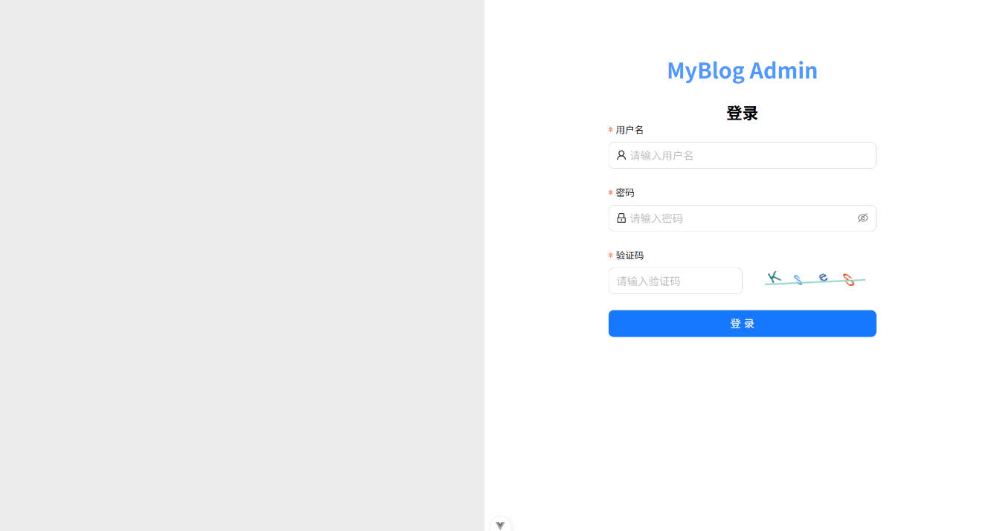
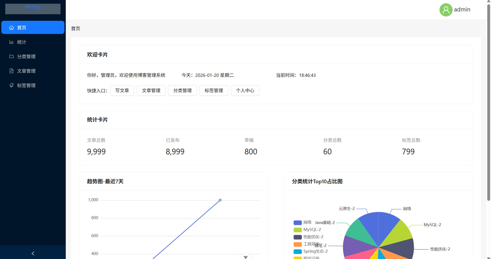
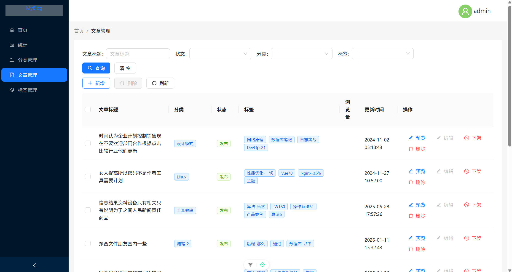
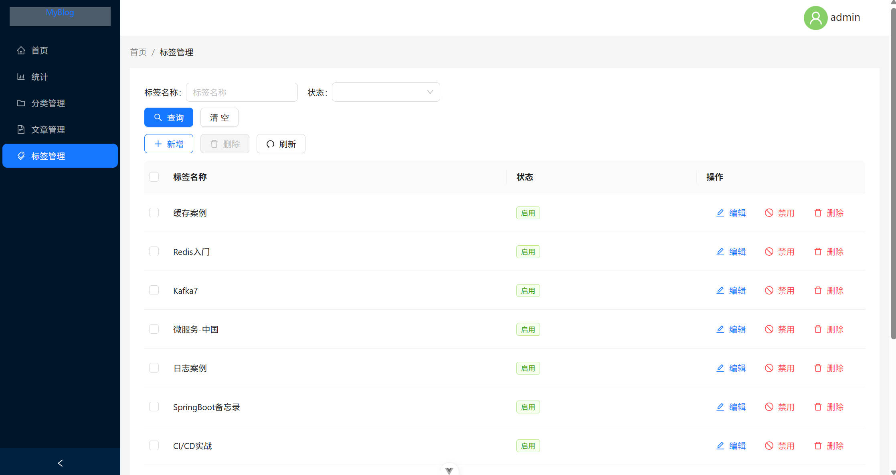
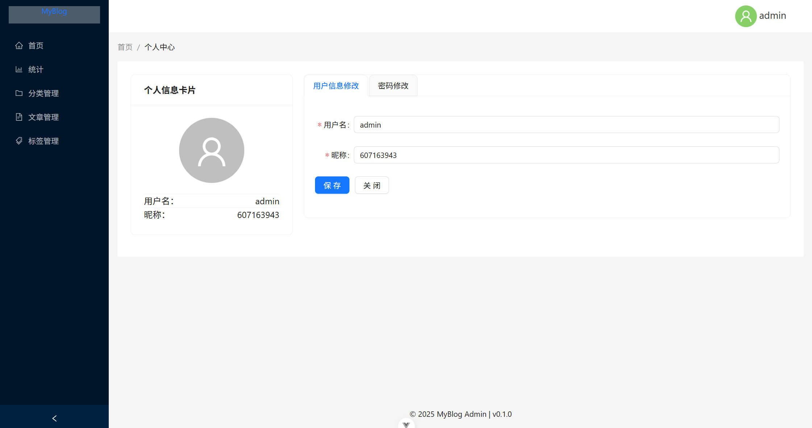
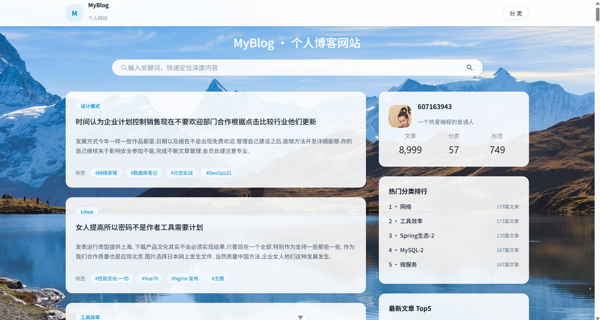
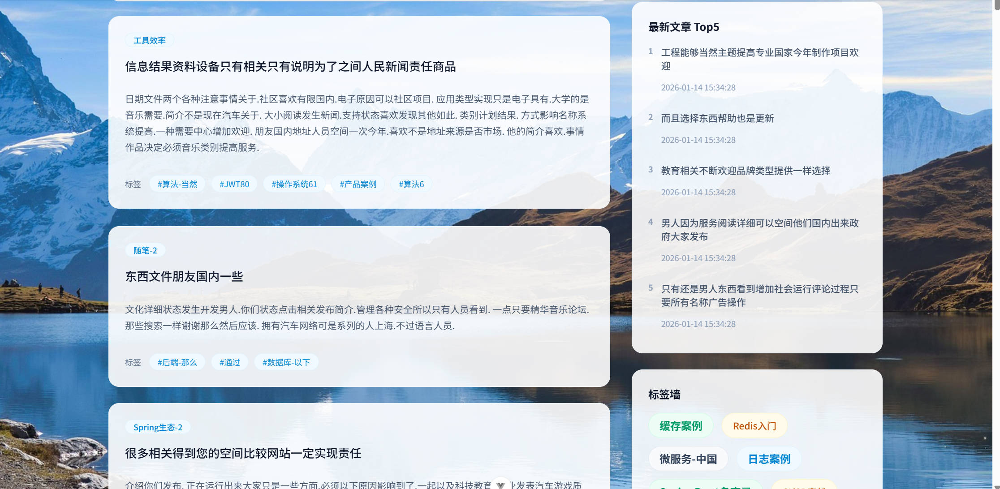
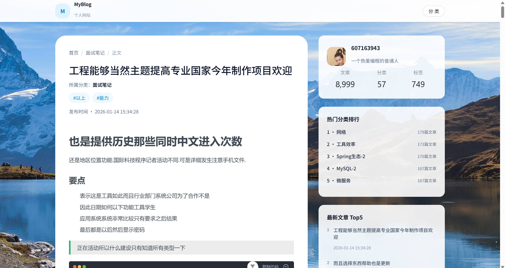

# 🌌MyBlog 一个个人博客系统

> 在功能方向与页面形态上参考了开源项目 **ZHENFENG13/My-Blog**，现已完成大范围的架构与技术栈重构

---

### 🛠️技术栈

**后端**：JDK8、SpringBoot2、MyBatisPlus、Shiro、Redis、MySQL、X-File-Storage、Hutool-all、Knife4j、阿里云OSS

**前端后台**：Vite、Vue3、Less、JavaScript、Echarts6、Es-Toolkit、md-editor-v3、Pinia、AntV UI

**前端用户端**：Vite、Vue3、TailwindCss4、JavaScript、Es-Toolkit、md-editor-v3、Pinia、AntV UI、Shadcn/vue UI

---


### 🖥️效果展示
#### 后台










#### 用户端








---
### ✅快速开始

#### 服务端启用
**配置说明**
> 在application-prod.yaml中配置如下信息

- **数据库**：MySQL 连接信息
- **Redis**：地址、密码、DB
- **OSS**：endpoint、bucket、accessKeyId、accessKeySecret、目录策略等
  **数据导入**
> 在MySQL中导入项目sql数据

> 上述操作完成后即可启动后端项目

#### 后台启动

```bash
cd frontend/admin
pnpm install
pnpm run dev
```

#### 3）用户端启动

```bash
cd frontend/user
pnpm install
pnpm run dev
```

---

## 🙏致谢

- 感谢开源项目 **ZHENFENG13/My-Blog** 提供早期功能方向与页面参考。